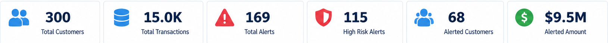
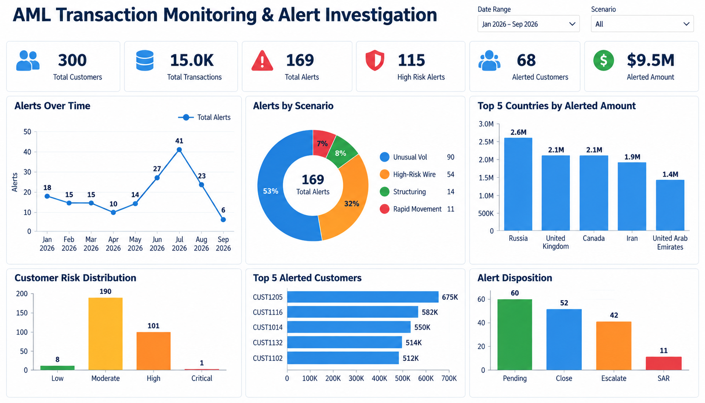
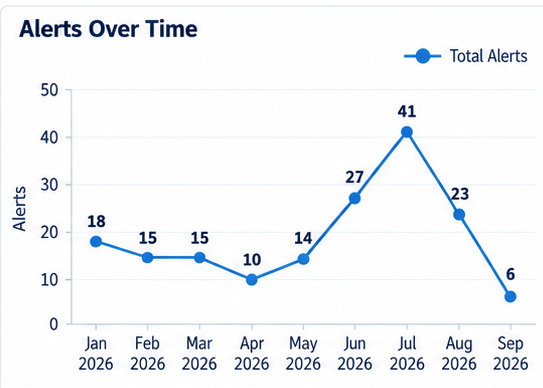
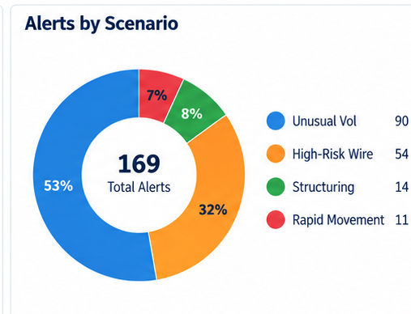
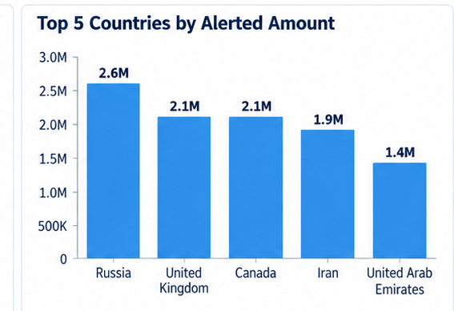
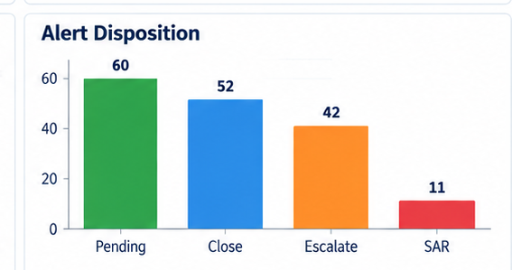

# AML Transaction Monitoring & Alert Investigation Analytics

## Project Summary
This project simulates an end-to-end AML transaction-monitoring and alert-investigation workflow using **SQL, Python, Tableau, and Streamlit**.

It demonstrates how an AML/Financial Crime analyst can move from raw transaction data to behavioral analytics, alert generation, customer risk scoring, investigator prioritization, and case-review support.

**All data in this project is synthetic.**

## Business Questions
- Which customers show unusual activity compared with expected behavior?
- Which alerts should investigators prioritize first?
- Are there possible structuring patterns?
- Are customers sending high-value wires to high-risk jurisdictions?
- Which customers show rapid movement or high transaction velocity?
- Which customers have elevated cross-border or counterparty exposure?
- Which alerts are most likely to require escalation?

## AML Scenarios
1. Potential Structuring
2. High-Risk Jurisdiction Wires
3. Unusual Volume Spikes
4. Rapid Movement / Velocity
5. Repeat Counterparties
6. Cross-Border Exposure
7. PEP / High-Risk Customer Monitoring

## Tools
- SQL
- Python
- pandas
- NumPy
- Tableau
- Streamlit
- Git / GitHub

## Project Structure
```text
AML_Transaction_Monitoring_Alert_Investigation_Analytics/
├── app/
│   ├── streamlit_app.py
│   └── requirements.txt
├── data/
│   ├── raw/
│   │   ├── customers.csv
│   │   └── transactions.csv
│   └── processed/
│       ├── alerts.csv
│       ├── customer_risk_features.csv
│       └── transactions_enriched.csv
├── notebooks/
│   └── aml_investigation_analysis.ipynb
├── sql/
│   └── aml_investigation_queries.sql
├── tableau/
│   └── TABLEAU_BUILD_GUIDE.md
├── docs/
├── images/
└── README.md
```

## Customer Risk Model
The project uses a transparent rule-based score from 0–100 based on:
- KYC risk rating
- PEP status
- high-risk jurisdiction exposure
- cash concentration
- wire concentration
- transaction volume compared with expected activity
- counterparty concentration / breadth

The model is designed for explainability rather than production use.

## Streamlit Investigator Workbench
The Streamlit app includes:
- alert queue filters
- risk-ranked alert review
- high-risk alert KPI cards
- escalation counts
- alert-dollar exposure
- customer 360 view
- KYC risk
- AML risk score
- PEP status
- expected activity
- cross-border exposure
- customer alert history
- recent transactions
- transaction trend
- investigator-notes field

### Run the app
```bash
cd app
pip install -r requirements.txt
streamlit run streamlit_app.py
```

## SQL Coverage
The project includes 12 focused SQL analyses:
- high-value transaction review
- structuring detection
- high-risk-country wires
- monthly volume analysis
- expected-vs-actual behavior
- rapid movement / velocity
- repeat counterparties
- cross-border exposure
- PEP activity
- alert scenario reporting
- escalation rate
- prioritized investigator queue

## Tableau
Two dashboards are recommended:
1. **AML Monitoring Overview**
2. **Investigator Workbench**

See `tableau/TABLEAU_BUILD_GUIDE.md`.

## Dashboard Preview

### KPI Scorecard


**What it represents:** Summarizes customers, transactions, alerts, high-risk alerts, alerted customers, and total alerted amount.

### Executive Dashboard


**What it represents:** Combines alert trends, scenarios, geographic exposure, customer risk, alerted customers, and investigation outcomes in one AML monitoring view.

### Alerts Over Time


**What it represents:** Tracks alert volume over time to highlight changes, spikes, and periods requiring increased investigator attention.

### Alerts by Scenario


**What it represents:** Shows which AML scenarios generate the most alerts, including unusual volume, high-risk wires, structuring, and rapid movement.

### Top 5 Countries by Alerted Amount


**What it represents:** Highlights countries associated with the largest alerted transaction amounts and geographic exposure requiring closer review.

### Alert Disposition


**What it represents:** Shows how alerts progress to pending, closure, escalation, or SAR outcomes, providing a clear view of investigation decisions.

## Resume Bullets
**AML Transaction Monitoring & Alert Investigation Analytics | SQL, Python, Tableau, Streamlit**

- Built an end-to-end AML transaction-monitoring analytics project using synthetic customer and transaction data to identify potential structuring, high-risk jurisdiction wires, unusual transaction volume, rapid movement of funds, and cross-border risk.
- Developed SQL detection logic and an explainable customer risk-scoring framework, then created Tableau and Streamlit investigator views for alert prioritization, customer review, transaction analysis, and escalation support.

## Interview Explanation
I built an AML transaction-monitoring and alert-investigation project that simulates the workflow from raw transaction data through alert generation and investigator review. SQL is used to identify red flags and unusual behavioral patterns, Python prepares and analyzes the data and produces an explainable customer risk score, Tableau supports management reporting, and Streamlit provides an investigator-style customer and alert review workbench.

## Disclaimer
This is an educational portfolio project using synthetic data. It does not use confidential financial-institution or customer information and is not intended to replace an institution's AML policies, models, regulatory obligations, sanctions controls, or investigator judgment.


## Dashboard Design Update
The final Tableau/Streamlit visual layer uses a compact white-background executive style. The dashboard includes KPI cards, alert trend, scenario donut chart, customer risk, disposition analytics, top alerted customers, and cross-border exposure labeled with full country names.


## Final Dashboard
The executive dashboard image in `images/02_executive_dashboard.png` is the approved final design.
It uses distinct, non-stacked bar charts for country exposure, customer risk distribution,
top five alerted customers, and alert disposition; a line chart for alerts over time; and
a donut chart for alert scenarios.
